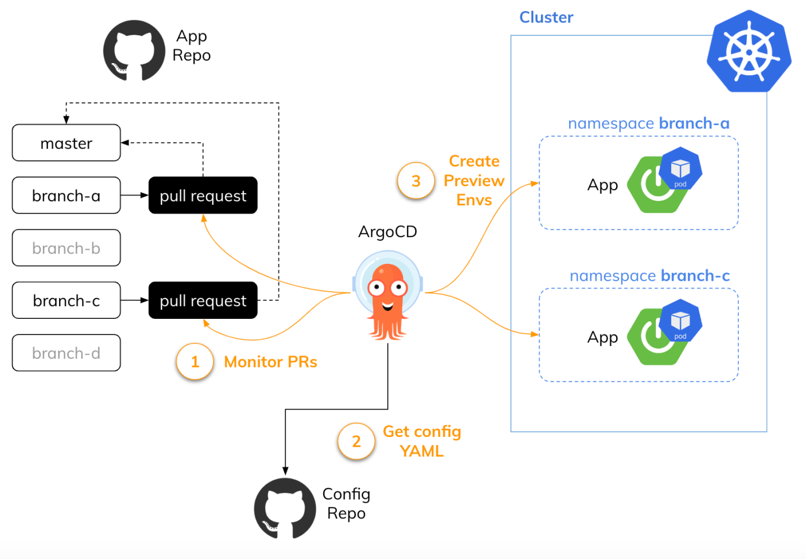
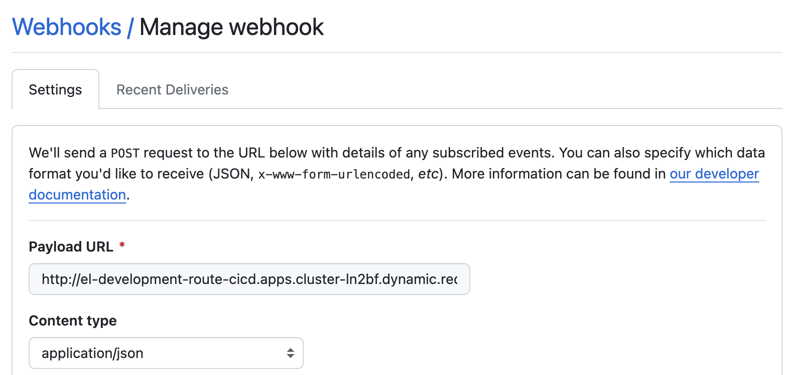

# README

## Introduction
This project tries to automate the build and deployment of a Quarkus application using Tekton Pipelines for Continuous Integration and ArgoCD for Continuous Deployment.

## Pre-requisites
1. A Github account to store the code.
2. An Openshift cluster
3. A Quay.io account to store the container images.
4. Sonarqube instance to analyze the code quality. [Sonarqube OCP helm chart](https://github.com/anmiralles/sonarqube-ocp4)
5. OpenShift pipelines (Tekton) and Openshift Gitops (ArgoCD) instances.

## Preview Environments
This approach allows us to generate an on-demand namespace for testing a specific git branch before it’s merged. If we use the GitOps approach in the CI/CD process it is worth considering ArgoCD for that. With ArgoCD and Helm charts, it is possible to organize that process in a fully automated and standardized way.

After creating a new pull request we want ArgoCD to provision a new preview environment on Kubernetes. Once we merge a pull request we want ArgoCD to remove the preview environment automatically. Fortunately, ArgoCD can monitor pull requests with ApplicationSet generators. Our ApplicationSet will connect to the app source repository to detect new pull requests. 



Step 1: Pipeline deployment

```shell script
oc apply -f cicd/pipelines/preview/
```

During this step we will deploy a trigger so that when there would be a push event in the git repository the pipeline will be fired.

Step 2: Configure git repository weebhook




Step 3: Gitops application deployment

```shell script
oc apply -f cicd/gitops/app-preview-config.yaml
```

Our solution will deploy a quarkus sample application. This is the related repository: [quarkus-getting-started](https://github.com/anmiralles/quarkus-getting-started)

Our pipeline will clone the app repository and execute s2i command in OCP baking an image and pushing it to a container registry.